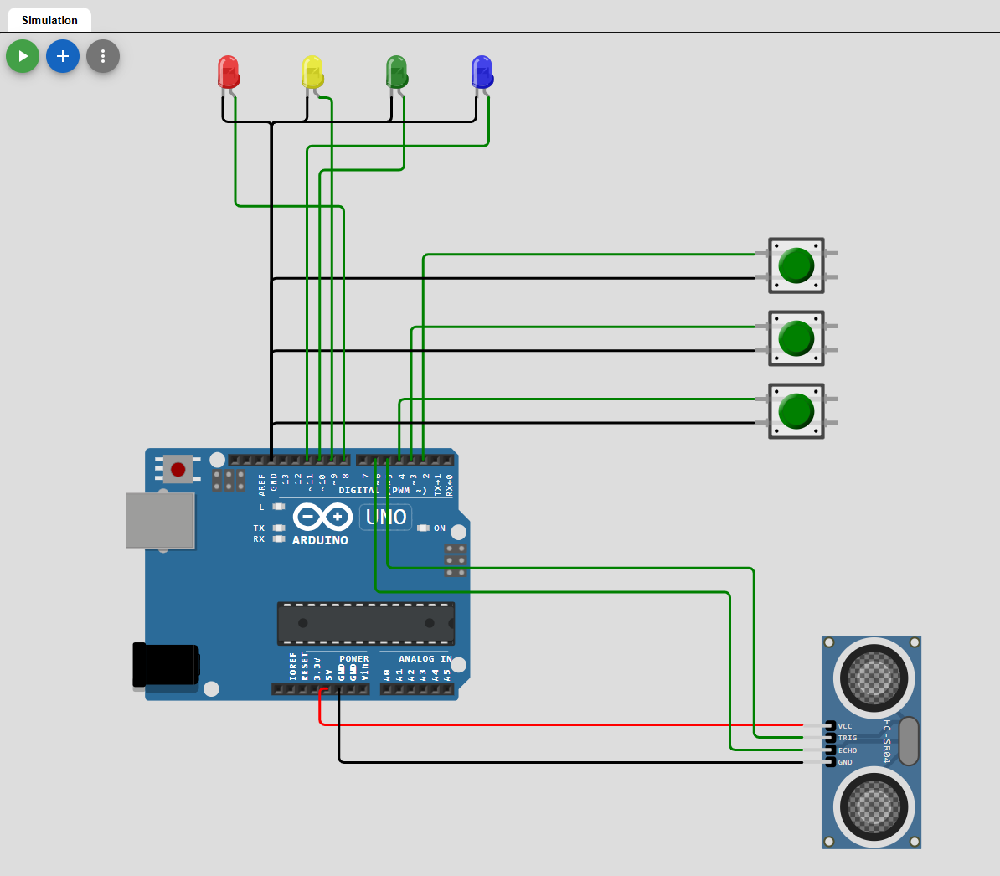

# RUS-vjezba1
Rješenje zadanog zadatka za vježbu 1 iz kolegija Razvoj ugradbenih sustava  
Link na Wokwi projekt: https://wokwi.com/projects/426955490900012033
!

# Opis zadatka
Ovaj projekt demonstrira korištenje prekida na mikrokontroleru koristeći Arduino Uno. Implementirani su različiti prekidi za obradu signala s tipkala, tajmera i senzora udaljenosti (HC-SR04). 

# Komponente
-Arduino Uno 
-3x Tipkala 
-4x LED diode 
-HC-SR04 

# Funkcionalnosti
1. Detekcija pritisaka tipkala s prioritetima 
Visoki prioritet (prekid INT0, pin 2) 
Srednji prioritet (prekid INT1, pin 3) 
Niski prioritet (ručno provjeravanje u glavnoj petlji, pin 4)  
2. Timer prekid (1 sekunda interval) 
Svake sekunde pokreće funkciju za mjerenje udaljenosti pomoću HC-SR04 senzora.  
3. Mjerenje udaljenosti i aktivacija LED indikatora 
Kada je udaljenost manja od 10 cm, uključuje se LED indikator (pin 11).  
4. Obrada svih prekida u glavnoj petlji prema prioritetima 
Prvo se obrađuju prekidi najvišeg prioriteta. 
Niski prioritet (tipka na pinu 4) se provjerava samo kada nema viših prioriteta. 
